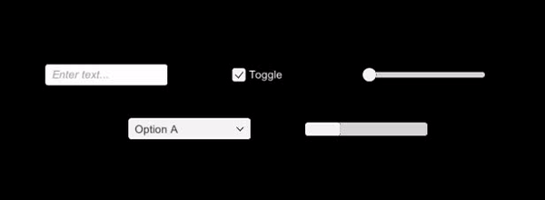

# Unity - Undo Redo System #

Undo Redo system implementation in Unity uGUI system. <br/><br/>


## Supported UI ##
* Input Field
* Dropdown
* Toggle
* Scrollbar
* Slider


## API ##
```
/* For undo/redo system. */
{
    GetComponent<JCS_UndoRedoSystem>().UndoComponent();

    GetComponent<JCS_UndoRedoSystem>().RedoComponent();
}

/* For single undo/redo component. */
{
    GetComponent<JCS_UndoRedoComponent>().Undo();

    GetComponent<JCS_UndoRedoComponent>().Redo();
}
```

## Screenshot ##



## 3rd Party Source ##
* JCSUnity : https://github.com/jcs090218/JCSUnity by <a href="https://github.com/jcs090218">Jen-Chieh Shen</a>
